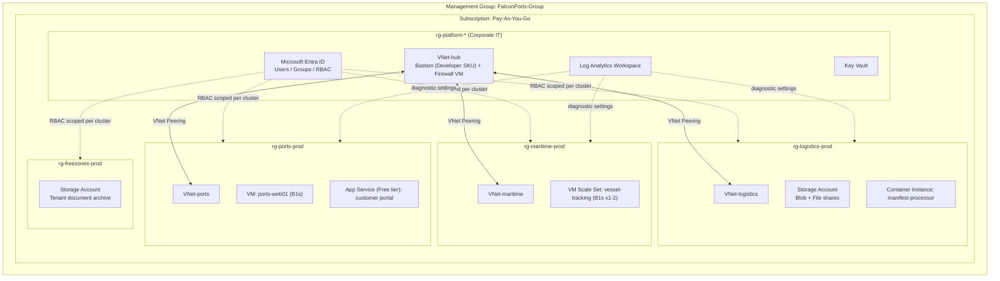

# FalconPorts Group — Azure Cloud Administration Lab (AZ-104)

A hands-on, portfolio-grade Azure environment built to **learn and demonstrate the Microsoft AZ-104 (Azure Administrator Associate) skill set by doing**, not by reading slides.

Instead of spinning up disconnected, throwaway resources, everything here is built as **one coherent fictional company** — FalconPorts Group — so that identity, governance, networking, compute, storage, and monitoring all fit together the way they would in a real organization.

> **Disclaimer:** FalconPorts Group is a fictional company created for this personal training project. Its five-cluster structure (Ports, Maritime, Logistics, Economic Cities & Free Zones, Digital) is *modeled on the publicly disclosed corporate structure of a real UAE ports & logistics operator, AD Ports Group*, purely to give the lab a realistic, industry-relevant scenario to practice against. This project is **independent, educational, and not affiliated with, endorsed by, or representing any real company**. No real company data, systems, or credentials are used anywhere in this repo.

---

## Table of Contents

1. [Why this project exists](#why-this-project-exists)
2. [The scenario: FalconPorts Group](#the-scenario-falconports-group)
3. [Architecture](#architecture)
4. [AZ-104 skills demonstrated](#az-104-skills-demonstrated)
5. [Cost strategy — built to run on a real budget](#cost-strategy--built-to-run-on-a-real-budget)
6. [Repo structure](#repo-structure)
7. [How to reproduce this project](#how-to-reproduce-this-project)
8. [Build phases](#build-phases)
9. [Using this for your resume/LinkedIn](#using-this-for-your-resumelinkedin)

---

## Why this project exists

The AZ-104 syllabus covers five domains: identity & governance, storage, compute, networking, and monitoring. It's easy to complete a video course and still not be able to design a resource group structure from scratch. This project forces that: every AZ-104 exam skill is practiced against a single, realistic company build instead of isolated demos, and every resource is documented well enough that a stranger (or a recruiter) can read this repo and understand exactly what was built and why.

## The scenario: FalconPorts Group

FalconPorts Group is a fictional Abu Dhabi-headquartered ports, maritime, logistics, and free-zone conglomerate, organized into five business clusters — the same shape as a real integrated ports operator:

| Cluster | What it represents |
|---|---|
| **Ports** | Terminal & cargo operations across multiple UAE port sites |
| **Maritime** | Vessel traffic, pilotage, and marine services |
| **Logistics** | Supply chain, freight forwarding, warehousing |
| **Economic Cities & Free Zones** | Industrial zone tenants, free-zone licensing |
| **Digital** | The internal IT/platform team running the trade & logistics platform |

Each cluster gets its own resource groups, network segment, and access boundaries, plus a shared **Platform/Corporate IT** layer (identity, connectivity, monitoring, security) that all clusters consume — exactly like a real enterprise landing zone, just sized down to fit a single low-cost subscription.

## Architecture



Full network, identity, and RBAC diagrams with explanations are in [`docs/`](docs/).

## AZ-104 skills demonstrated

| Exam domain (weight) | Where it's built in this repo |
|---|---|
| Identities & governance (20–25%) | [`docs/01-identity-and-governance.md`](docs/01-identity-and-governance.md) — Entra ID users/groups, RBAC at MG/sub/RG scope, Azure Policy, resource locks, tags, budgets, management groups |
| Storage (15–20%) | [`docs/04-storage.md`](docs/04-storage.md) — storage accounts, SAS/stored access policies, Azure Files identity-based access, replication, lifecycle management, soft delete, versioning |
| Compute (20–25%) | [`docs/03-compute.md`](docs/03-compute.md) — Bicep deployments, VMs, VM Scale Sets, Container Instances/ACR, App Service with deployment slots |
| Virtual networking (15–20%) | [`docs/02-networking.md`](docs/02-networking.md) — hub-spoke VNets, peering, NSGs/ASGs, Bastion, private endpoints, service endpoints, load balancers, DNS |
| Monitor & maintain (10–15%) | [`docs/05-monitoring-and-backup.md`](docs/05-monitoring-and-backup.md) — Log Analytics, alerts/action groups, VM insights, Recovery Services vault, backup policy |

## Cost strategy — built to run on a real budget

This was built on a standard Pay-As-You-Go subscription with **no free trial credit remaining**, so every decision below was made to keep this runnable for a few dollars a month:

- **Always Free tier first**: App Service F1, 5 GB/month Log Analytics ingestion, Entra ID free tier features.
- **Azure Bastion Developer SKU** instead of Standard (saves ~$140/month).
- **B-series burstable VMs** (B1s/B2s) only, deallocated (not just stopped) at the end of every session.
- **No always-on NAT Gateway / Azure Firewall / VPN Gateway** — concepts covered via a low-cost NVA VM or config-only walkthroughs instead.
- **Container Instances** for anything that only needs to run for minutes (billed per second).
- **A subscription budget with alerts at 50/80/100%** configured on day one, before anything else is deployed.
- **Everything is torn down** (`scripts/cleanup.sh`) at the end of each study session; IaC means it can be rebuilt in minutes.
- **One region only** (`uaenorth`, falling back to `eastus` if a SKU isn't available there) to avoid cross-region egress and data transfer charges.

Full teardown/cost-control checklist: [`docs/06-teardown-and-cost-control.md`](docs/06-teardown-and-cost-control.md). Estimated cost if you tear down compute after each session: **under $10–15/month**, mostly storage and the small always-on pieces (Log Analytics ingestion, a couple of tiny storage accounts).

## Repo structure

```
az104-falconports-lab/
├── README.md                  ← you are here
├── PROGRESS_CHECKLIST.md       ← tick off every AZ-104 sub-skill as you build it
├── architecture/               ← diagram source
├── docs/                       ← one doc per build phase, in order
├── iac/                        ← Bicep templates for repeatable deployment
├── scripts/                    ← deploy / cleanup / budget / auto-shutdown helpers
└── resume/                     ← ready-to-use resume & LinkedIn bullet points
```

## How to reproduce this project

**Prerequisites:** an Azure subscription (Pay-As-You-Go is fine), [Azure CLI](https://learn.microsoft.com/cli/azure/install-azure-cli) installed, and (optional but recommended) [Bicep CLI](https://learn.microsoft.com/azure/azure-resource-manager/bicep/install) (`az bicep install`).

```bash
git clone <your-repo-url>
cd az104-falconports-lab

az login
az account set --subscription "<your-subscription-name>"

# 1. Set a spending guardrail BEFORE deploying anything
bash scripts/set-budget.sh

# 2. Work through docs/ in order (01 → 06), running the matching
#    az cli commands / bicep deployments as you go
```

Do **not** run everything at once. Work through [`docs/`](docs/) phase by phase, over several study sessions — that's the point of the project, and it also means you're never paying for resources you're not actively using.

## Build phases

| Phase | Doc | What you'll do |
|---|---|---|
| 0 | [`00-overview-and-cost-strategy.md`](docs/00-overview-and-cost-strategy.md) | Tenant setup, subscription hygiene, budget/alerts, naming & tagging convention |
| 1 | [`01-identity-and-governance.md`](docs/01-identity-and-governance.md) | Entra ID users/groups, RBAC, Azure Policy, management groups, locks |
| 2 | [`02-networking.md`](docs/02-networking.md) | Hub-spoke VNets, NSGs, Bastion, private/service endpoints, load balancer |
| 3 | [`03-compute.md`](docs/03-compute.md) | Bicep, VMs, scale sets, containers, App Service |
| 4 | [`04-storage.md`](docs/04-storage.md) | Storage accounts, SAS, Azure Files, lifecycle, replication |
| 5 | [`05-monitoring-and-backup.md`](docs/05-monitoring-and-backup.md) | Log Analytics, alerts, Azure Backup, Site Recovery concepts |
| 6 | [`06-teardown-and-cost-control.md`](docs/06-teardown-and-cost-control.md) | Clean shutdown routine + cost review after every session |

## Using this for your resume/LinkedIn

Ready-to-copy project description and bullet points, written to map directly to the AZ-104 skills measured, are in [`resume/resume-bullets.md`](resume/resume-bullets.md). Only use lines that describe things you actually built and can talk through in an interview.
# az104-falconports-lab

